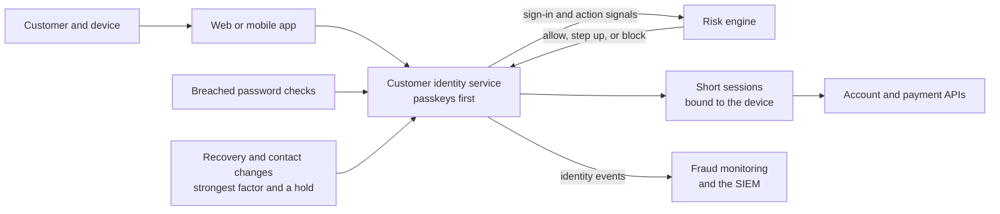

<!-- Generated by scripts/build.mjs from data/patterns/P17.json. Edit the data, then run npm run build. -->

[العربية](../ar/P17-customer-identity.md)

# P17 Customer identity and account protection

> Let customers sign in with passkeys, judge the risk of every sign-in and every sensitive action, and make account recovery as strong as the sign-in itself, so that stolen passwords and intercepted codes stop being enough to take over an account.

| Domain | Related patterns |
| --- | --- |
| Identity | [P02 Identity as the control plane](P02-identity-control-plane.md), [P07 API gateway and object level authorization](P07-api-security.md), [P10 Security telemetry and detection pipeline](P10-detection-telemetry.md), [P27 Mobile application protection](P27-mobile-app-protection.md) |

## The problem

Customer accounts are attacked at scale with passwords leaked from other sites, with phishing pages that relay one-time codes in real time, and with SIM swaps that redirect text messages. Each successful takeover becomes fraud, a complaint, and a question from the regulator, while controls that frustrate honest customers push them to call centres, where recovery is often the weakest link.

## Use it when

- Customers sign in to a web or mobile service over the internet.
- Accounts hold money, personal data, or anything worth stealing.
- Fraud from account takeover already costs you, or a regulator expects strong customer authentication.

## The design

Run customer identity as its own service, separate from the workforce identity provider, and make passkeys the default way to sign in, with a fallback that still resists phishing, such as a push approval bound to the device. Score every sign-in and every sensitive action, such as adding a payee or changing a phone number, with signals like device reputation, location, velocity, and known breached passwords, then allow, step up, or block.

Treat account recovery and changes to contact details as the riskiest sign-ins of all: require the strongest factor the customer has, notify the old contact details, and hold high-value actions for a cooling-off period. Bind sessions to the device, keep them short for sensitive actions, and send identity events to fraud monitoring and the SIEM, so that a takeover in progress can be stopped rather than refunded.

## Controls

### Foundation

- **Block known breached passwords:** Check new and changed passwords against lists of breached passwords, and throttle sign-in attempts per account and per source.
  `NIST IA-5` `NIST AC-7` `ISO A.5.17`
- **Offer strong authentication to every customer:** Offer passkeys or an app-based approval to every customer, and require them for sensitive actions such as payments to new payees.
  `NIST IA-2(1)` `NIST IA-8` `CIS 6.3` `ISO A.8.5`
- **Protect account recovery:** Make recovery and changes to contact details require the strongest factor the customer has, and notify the customer through the old channel.
  `NIST IA-5` `NIST IA-8` `ISO A.5.17`

### Enhanced

- **Score the risk of every sign-in:** Evaluate device, location, network, and behaviour signals on every sign-in and sensitive action, and step up or block when the risk is high.
  `NIST IA-11` `NIST SI-4` `ISO A.8.16`
- **Bind sessions to the device:** Issue short sessions bound to the device, and authenticate again before sensitive actions, so that a stolen cookie is not enough.
  `NIST SC-23` `NIST AC-12` `ISO A.8.5`
- **Send identity events to fraud monitoring:** Stream sign-ins, recoveries, and changes to contact details into fraud monitoring and the SIEM, with rules for takeover patterns.
  `NIST AU-2` `NIST SI-4` `CIS 8.2` `ISO A.8.15` `ISO A.8.16`

### Advanced

- **Make passkeys the default:** Enrol customers in passkeys by default, and retire text message codes for sensitive actions once enough customers have a phishing-resistant factor.
  `NIST IA-2(1)` `NIST IA-2(2)` `CIS 6.3` `ISO A.8.5`
- **Hold high-value changes for a cooling-off period:** Delay high-value payments after a recovery or a change of contact details, and let the customer cancel them from a trusted channel.
  `NIST AC-3` `NIST SI-4` `ISO A.5.15`

## Decisions to record

- Which actions count as sensitive, and which strength of authentication does each one need?
- Which fallback do customers without a passkey get, and how will you move them off text message codes?
- Who owns the decision on a risky sign-in: the identity service, the fraud team, or both?

## Trade-offs

- Every extra step at sign-in costs some customers, so friction has to be spent on risky moments, not on every visit.
- Risk scoring needs data about devices and behaviour, which brings privacy duties of its own.
- Passkeys depend on the customer's platform, so support for older and shared devices needs a plan.

## Anti-patterns to avoid

- Text message codes as the only second factor for payments.
- A call centre that resets accounts after a few personal questions.
- The same identity provider and administrators for customers and staff.

## How to verify it

- Replay a real phishing kit against a test account, and confirm that the relayed code does not grant a session.
- Change the phone number on a test account, and confirm the notice to the old number and the hold on payments.
- Run a credential stuffing test at low volume, and confirm that throttling and detection both trigger.

## Threats it addresses

| Reference | Name |
| --- | --- |
| [T1110.004](https://attack.mitre.org/techniques/T1110/004/) | Brute Force: Credential Stuffing |
| [T1539](https://attack.mitre.org/techniques/T1539/) | Steal Web Session Cookie |
| [T1111](https://attack.mitre.org/techniques/T1111/) | Multi-Factor Authentication Interception |
| [T1621](https://attack.mitre.org/techniques/T1621/) | Multi-Factor Authentication Request Generation |
| [API2:2023](https://owasp.org/API-Security/editions/2023/en/0xa2-broken-authentication/) | Broken Authentication |

## References

- [FIDO Alliance, passkeys](https://fidoalliance.org/passkeys/)
- [NIST SP 800-63B, Digital Identity Guidelines: Authentication](https://csrc.nist.gov/pubs/sp/800/63/b/4/final)
- [OWASP Authentication Cheat Sheet](https://cheatsheetseries.owasp.org/cheatsheets/Authentication_Cheat_Sheet.html)
