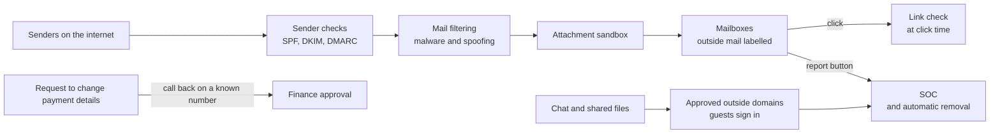

<!-- Generated by scripts/build.mjs from data/patterns/P18.json. Edit the data, then run npm run build. -->

[العربية](../ar/P18-email-and-collaboration.md)

# P18 Email and collaboration protection

> Authenticate your domains with SPF, DKIM, and DMARC at reject, filter every message and link before and after delivery, and control who from outside can join your chats and shared files, because email and collaboration tools are where most intrusions start.

| Domain | Related patterns |
| --- | --- |
| Workplace | [P02 Identity as the control plane](P02-identity-control-plane.md), [P19 Managed and hardened endpoints](P19-managed-endpoints.md), [P10 Security telemetry and detection pipeline](P10-detection-telemetry.md) |

## The problem

Phishing and business email compromise remain the most common first step of an intrusion and the most expensive kind of fraud. Attackers spoof your domain to your customers, send links that pass filters and turn malicious hours later, and move from a compromised partner mailbox into real conversations about invoices. Collaboration tools add guests, shared links, and chat messages from outside, which often bypass the controls built for email.

## Use it when

- People in the organisation use email and chat to work with customers, partners, and suppliers.
- Payments or sensitive data are ever requested or approved by email.
- Your domain is a brand that criminals could impersonate to your customers.

## The design

Publish SPF and DKIM for every domain that sends mail, including the services that send on your behalf, then move DMARC from monitoring to reject and protect parked domains that never send. Route inbound mail through filtering that checks sender authentication, runs attachments in a sandbox, rewrites links and checks them again at the moment they are clicked, and labels messages from outside.

Make payment and bank detail changes requested by email subject to a call back on a known number, whatever the message looks like. In collaboration tools, allow external access only from approved domains, require guests to sign in, expire shared links, and apply the same malware and data loss checks to files and messages as to email. Give people one button to report a suspicious message, and send reports and mail telemetry to the SOC.

## Controls

### Foundation

- **Authenticate your sending domains:** Publish SPF and DKIM for every sending domain and service, and a DMARC record with reporting.
  `NIST SI-8` `CIS 9.5` `ISO A.8.21`
- **Filter inbound mail and attachments:** Scan inbound mail for malware and spoofing, block file types you never need, and label messages from outside.
  `NIST SI-3` `NIST SI-8` `CIS 9.6` `CIS 9.7` `ISO A.8.7`
- **Verify payment changes outside email:** Confirm new or changed bank details and urgent payment requests by calling a known number, never one given in the message, and train staff to do so.
  `NIST AT-2` `CIS 14.2` `ISO A.6.3`

### Enhanced

- **Move DMARC to reject:** Move DMARC from monitoring to quarantine and then to reject, and publish a reject policy for domains that never send mail.
  `NIST SI-8` `CIS 9.5` `ISO A.8.21`
- **Run attachments in a sandbox and check links at click time:** Open attachments in a sandbox before delivery, and rewrite links so that they are checked again when someone clicks them.
  `NIST SC-44` `NIST SI-3` `CIS 9.3` `CIS 10.7` `ISO A.8.7` `ISO A.8.23`
- **Control guests and sharing in collaboration tools:** Allow external chat and guests only from approved domains, require guests to sign in, and expire shared links.
  `NIST AC-3` `NIST AC-4` `CIS 3.3` `ISO A.5.14` `ISO A.8.12`

### Advanced

- **Make reporting one click and close the loop:** Give everyone a report button, remove reported messages from every mailbox automatically, and tell the reporter what happened.
  `NIST IR-6` `NIST SI-8` `ISO A.6.8`
- **Hunt across mail and chat telemetry:** Send mail, chat, and sharing events to the SOC, and hunt for mailbox rules, unusual forwarding, and consent to risky applications.
  `NIST SI-4` `NIST AU-6` `CIS 8.2` `CIS 13.1` `ISO A.8.16`

## Decisions to record

- Which services send mail as your domains, and who owns the SPF and DKIM set-up of each one?
- How fast can DMARC move to reject without blocking legitimate mail?
- Which outside organisations may chat and share with your people, and who approves new ones?

## Trade-offs

- A strict DMARC policy can drop mail from services that were never set up correctly, so it needs an inventory first.
- Sandboxing and link checks add seconds of delay that some users notice.
- Tight limits on outside collaboration slow down work with partners, so the approved list must be easy to update.

## Anti-patterns to avoid

- DMARC left at monitoring for years.
- Payment details changed on the strength of an email alone.
- Chat open to any outside organisation, with no one reviewing who joins.

## How to verify it

- Send a message that spoofs your own domain from outside, and confirm that it is rejected.
- Send a test attachment that runs a harmless script, and confirm that the sandbox catches it.
- Report a test phishing message, and confirm that it disappears from every mailbox that received it.

## Threats it addresses

| Reference | Name |
| --- | --- |
| [T1566.001](https://attack.mitre.org/techniques/T1566/001/) | Phishing: Spearphishing Attachment |
| [T1566.002](https://attack.mitre.org/techniques/T1566/002/) | Phishing: Spearphishing Link |
| [T1534](https://attack.mitre.org/techniques/T1534/) | Internal Spearphishing |
| [T1684.001](https://attack.mitre.org/techniques/T1684/001/) | Social Engineering: Impersonation |
| [T1114](https://attack.mitre.org/techniques/T1114/) | Email Collection |

## References

- [DMARC.org](https://dmarc.org/)
- [RFC 7489, Domain-based Message Authentication, Reporting, and Conformance](https://datatracker.ietf.org/doc/html/rfc7489)
- [CIS Controls v8.1, Control 9: Email and Web Browser Protections](https://www.cisecurity.org/controls/email-and-web-browser-protections)
