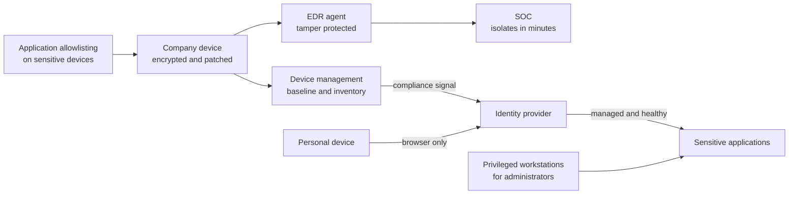

<!-- Generated by scripts/build.mjs from data/patterns/P19.json. Edit the data, then run npm run build. -->

[العربية](../ar/P19-managed-endpoints.md)

# P19 Managed and hardened endpoints

> Give access only to devices that the organisation manages, keep them hardened, patched, and encrypted, remove local administrator rights, and watch them with endpoint detection and response, because the laptop is where users meet attackers.

| Domain | Related patterns |
| --- | --- |
| Workplace | [P01 Zero trust access](P01-zero-trust-access.md), [P03 Tiered privileged access](P03-tiered-privileged-access.md), [P10 Security telemetry and detection pipeline](P10-detection-telemetry.md) |

## The problem

Most intrusions touch an endpoint: a user opens an attachment, a browser runs a malicious download, or a stolen laptop still holds cached credentials. Devices that users administer themselves collect unpatched software and tools that switch off protection, and personal devices reach company data with no way to check their state or wipe them.

## Use it when

- Staff use laptops, desktops, or phones to reach company systems or data.
- People work remotely, or bring their own devices.
- Administrators and developers use their own workstations for privileged work.

## The design

Enrol every company device in device management with a hardened baseline: full disk encryption, a host firewall, automatic updates, and no local administrator rights for everyday accounts. Run endpoint detection and response on every device, with tamper protection so that neither malware nor users can switch it off, and send its telemetry to the SOC.

Make access decisions depend on the device: the identity provider checks that a device is managed, compliant, and healthy before it gives access to sensitive applications, and personal devices get browser-only access or an isolated work profile. Control what can run on sensitive devices with application allowlisting, and give administrators separate privileged workstations.

## Controls

### Foundation

- **Manage every company device:** Enrol every device in device management, keep an inventory, and be able to lock or wipe a lost device.
  `NIST CM-8` `NIST AC-19` `CIS 1.1` `CIS 4.1` `ISO A.8.1`
- **Encrypt and patch every device:** Turn on full disk encryption, and apply operating system and browser updates automatically within days.
  `NIST SC-28` `NIST SI-2` `CIS 3.6` `CIS 7.3` `ISO A.8.1` `ISO A.8.8`
- **Remove local administrator rights:** Take local administrator rights away from everyday accounts, and handle exceptions through a request that expires.
  `NIST AC-6` `NIST CM-11` `CIS 5.4` `ISO A.8.2`

### Enhanced

- **Run endpoint detection and response everywhere:** Deploy EDR with tamper protection on every device, and send its alerts to the SOC with a playbook for isolation.
  `NIST SI-3` `NIST SI-4` `CIS 10.1` `CIS 10.7` `ISO A.8.7` `ISO A.8.16`
- **Check device health before access:** Let the identity provider require a managed, compliant device for sensitive applications, and give personal devices browser-only access.
  `NIST AC-17` `NIST IA-3` `ISO A.8.1` `ISO A.6.7`
- **Harden the baseline:** Apply a benchmark baseline, turn on the host firewall, and block macros from the internet and unsigned scripts.
  `NIST CM-6` `NIST CM-7` `CIS 4.1` `CIS 4.5` `ISO A.8.9`

### Advanced

- **Allow only approved applications:** Use application and script allowlisting on administrator workstations and other sensitive devices.
  `NIST CM-7` `NIST CM-14` `CIS 2.5` `CIS 2.7` `ISO A.8.19`
- **Isolate a compromised device in minutes:** Let the SOC isolate a device from the network remotely, keep it reachable for investigation, and test this regularly.
  `NIST IR-4` `NIST SI-4` `CIS 17.4` `ISO A.5.26`

## Decisions to record

- Which applications need a managed device, and which may personal devices reach through the browser?
- Who may hold local administrator rights, for how long, and who approves it?
- How quickly must critical updates reach every device, and what happens to devices that miss the deadline?

## Trade-offs

- Removing local administrator rights creates requests for software, so a self-service catalogue has to exist from the first day.
- Allowlisting stops unknown software, including tools that developers need, so it fits some roles better than others.
- Device checks block people on the road when a device falls out of compliance, so remediation must be quick and clear.

## Anti-patterns to avoid

- Everyday accounts with local administrator rights.
- An EDR agent that users or malware can switch off.
- Personal devices syncing company files with no management at all.

## How to verify it

- Try to stop the EDR agent as a local user and as an administrator, and confirm that tamper protection blocks both.
- Sign in to a sensitive application from an unmanaged device, and confirm that access is refused or limited to the browser.
- Compare the device inventory with sign-in logs, and find devices that sign in without being managed.

## Threats it addresses

| Reference | Name |
| --- | --- |
| [T1204](https://attack.mitre.org/techniques/T1204/) | User Execution |
| [T1059](https://attack.mitre.org/techniques/T1059/) | Command and Scripting Interpreter |
| [T1566.001](https://attack.mitre.org/techniques/T1566/001/) | Phishing: Spearphishing Attachment |
| [T1003](https://attack.mitre.org/techniques/T1003/) | OS Credential Dumping |

## References

- [CIS Benchmarks](https://www.cisecurity.org/cis-benchmarks)
- [NIST SP 800-124 Rev 2, Guidelines for Managing the Security of Mobile Devices in the Enterprise](https://csrc.nist.gov/pubs/sp/800/124/r2/final)
- [Australian Cyber Security Centre, Essential Eight](https://www.cyber.gov.au/resources-business-and-government/essential-cyber-security/essential-eight)
