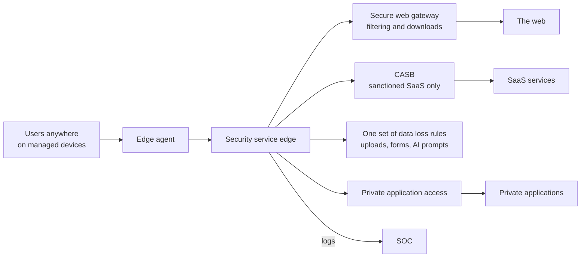

<!-- Generated by scripts/build.mjs from data/patterns/P20.json. Edit the data, then run npm run build. -->

[العربية](../ar/P20-security-service-edge.md)

# P20 Security service edge for users anywhere

> Send users' web and SaaS traffic through one cloud security edge that filters the web, governs SaaS use, inspects for data loss, and brokers private applications, so that the same policy follows people wherever they work.

| Domain | Related patterns |
| --- | --- |
| Workplace | [P01 Zero trust access](P01-zero-trust-access.md), [P05 Protected internet edge and controlled egress](P05-internet-edge-and-egress.md), [P09 Data-centric protection](P09-data-centric-protection.md) |

## The problem

Users no longer sit behind the office firewall. Their laptops reach the internet and SaaS directly from home and hotels, so web filtering, data loss prevention, and malware inspection built into the data centre see less and less of the traffic. Staff paste data into personal cloud storage and new AI tools, and attackers host malware and command servers on the same popular cloud services that everyone uses.

## Use it when

- Staff work from home, travel, or branch offices without a strong local security stack.
- The organisation relies on SaaS, and people can reach services that nobody approved.
- Sensitive data could leave through the web, personal storage, or AI tools.

## The design

Install one agent on managed devices that sends web and SaaS traffic to a cloud security edge, with a secure web gateway that blocks malicious and uncategorised sites, inspects downloads, and decrypts traffic where the law and your policy allow. Use the same edge to broker access to private applications, so that remote access and web security share one policy and one set of logs.

Govern SaaS with a cloud access security broker: discover which services people use, sanction the approved ones, block or restrict the rest, and connect to the APIs of the approved services to find oversharing and risky integrations. Apply one set of data loss rules to uploads, web forms, AI prompts, and sharing in SaaS, and start in monitoring mode to learn before you block.

## Controls

### Foundation

- **Filter the web for every user:** Block malicious, newly registered, and uncategorised sites for every managed device, on and off the network.
  `NIST SC-7` `NIST SI-3` `CIS 9.2` `CIS 9.3` `ISO A.8.23`
- **Discover SaaS use:** Find out which SaaS services people use and with which data, and decide which ones are sanctioned.
  `NIST CM-8` `NIST SA-9` `CIS 2.1` `ISO A.5.23`
- **Inspect downloads:** Scan downloaded files for malware, and block file types that users never need.
  `NIST SI-3` `CIS 10.1` `ISO A.8.7`

### Enhanced

- **Govern SaaS with a CASB:** Block unsanctioned services, restrict risky actions in sanctioned ones, and use API connections to find oversharing.
  `NIST AC-4` `NIST SA-9` `CIS 3.3` `ISO A.5.23` `ISO A.8.12`
- **Apply one set of data loss rules:** Apply the same data loss rules to uploads, web forms, AI prompts, and sharing in SaaS, starting in monitoring mode.
  `NIST AC-4` `NIST SI-4` `CIS 3.13` `ISO A.8.12`
- **Broker private applications through the same edge:** Give remote users access to private applications through the edge instead of a network VPN, per application and per user.
  `NIST AC-17` `NIST AC-3` `CIS 13.5` `ISO A.6.7` `ISO A.8.20`

### Advanced

- **Isolate risky browsing:** Open uncategorised and risky sites in remote browser isolation, so that no active content reaches the device.
  `NIST SC-7(21)` `NIST SC-44` `CIS 9.3` `ISO A.8.23`
- **Watch for data leaving through web services:** Alert on large uploads to personal storage and new services, and correlate them with user risk in the SOC.
  `NIST SI-4(4)` `NIST AU-6` `CIS 13.1` `ISO A.8.16`

## Decisions to record

- Which traffic will you decrypt, and which categories stay private, such as health and banking?
- Which SaaS and AI services are sanctioned, and who decides on new ones?
- Will private applications move from the VPN to the edge, and in what order?

## Trade-offs

- Decrypting traffic gives visibility but touches privacy and breaks some applications, so exceptions must be deliberate.
- One provider for web, SaaS, and private access is simpler to run but concentrates dependency in one place.
- Blocking unsanctioned services without offering good ones pushes people to personal devices.

## Anti-patterns to avoid

- Web filtering that works only in the office.
- Data loss rules switched to blocking on the first day, then switched off after the complaints.
- A full tunnel VPN as the only control for remote users.

## How to verify it

- Visit a test malicious site from a managed laptop at home, and confirm that it is blocked and logged.
- Upload a file with test sensitive data to a personal storage service, and confirm that the data loss rule fires.
- Compare the SaaS discovery report with the sanctioned list, and review what is new.

## Threats it addresses

| Reference | Name |
| --- | --- |
| [T1189](https://attack.mitre.org/techniques/T1189/) | Drive-by Compromise |
| [T1567](https://attack.mitre.org/techniques/T1567/) | Exfiltration Over Web Service |
| [T1071](https://attack.mitre.org/techniques/T1071/) | Application Layer Protocol |

## References

- [NIST SP 800-215, Guide to a Secure Enterprise Network Landscape](https://csrc.nist.gov/pubs/sp/800/215/final)
- [NIST SP 800-207, Zero Trust Architecture](https://csrc.nist.gov/pubs/sp/800/207/final)
- [CIS Controls v8.1, Control 3: Data Protection](https://www.cisecurity.org/controls/data-protection)
