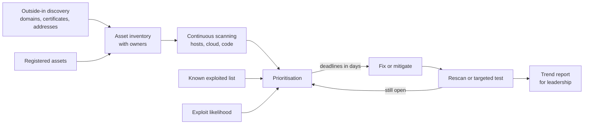

<!-- Generated by scripts/build.mjs from data/patterns/P21.json. Edit the data, then run npm run build. -->

[العربية](../ar/P21-exposure-management.md)

# P21 Continuous exposure management

> Keep a live inventory of everything you expose, find vulnerabilities and misconfigurations continuously, fix first what attackers are exploiting now, and prove the fixes with tests, instead of chasing every scanner finding.

| Domain | Related patterns |
| --- | --- |
| Operations | [P05 Protected internet edge and controlled egress](P05-internet-edge-and-egress.md), [P11 Trusted software supply chain](P11-software-supply-chain.md), [P06 Cloud landing zone with guardrails](P06-cloud-landing-zone.md) |

## The problem

Vulnerability scanners produce thousands of findings, and teams patch by severity score while attackers exploit a small set of known vulnerabilities, often within days of disclosure. Internet-facing systems that nobody listed, forgotten test environments, and expired certificates are found by attackers before they are found by the organisation.

## Use it when

- Any system is reachable from the internet or from partners.
- Patching falls behind, or is prioritised by severity scores alone.
- Teams can create cloud resources and public endpoints on their own.

## The design

Build the inventory from the outside in: discover your domains, certificates, IP ranges, and cloud accounts the way an attacker would, and reconcile them with the asset inventory, so that unknown exposure becomes a finding of its own. Scan internal and external assets continuously, including cloud configuration and code dependencies, and attach an owner to every asset.

Prioritise by what is exploited and what is exposed: vulnerabilities in the CISA Known Exploited Vulnerabilities catalogue, and those with a high likelihood of exploitation on internet-facing assets, come first, with deadlines measured in days. Track remediation against those deadlines, use mitigations when a fix cannot wait, and confirm closure with a rescan or a targeted test, not with a ticket status.

## Controls

### Foundation

- **Inventory what you expose:** Discover internet-facing domains, addresses, and services continuously, and give each one an owner.
  `NIST CM-8` `NIST RA-5` `CIS 1.1` `ISO A.5.9`
- **Scan internal and external assets:** Scan all assets for vulnerabilities at least monthly, and internet-facing assets at least weekly.
  `NIST RA-5` `CIS 7.1` `CIS 7.6` `ISO A.8.8`
- **Fix exploited vulnerabilities first:** Patch vulnerabilities that are known to be exploited on exposed assets within days, and track every deadline.
  `NIST SI-2` `NIST SI-5` `CIS 7.2` `CIS 7.7` `ISO A.8.8`

### Enhanced

- **Prioritise with exploit intelligence:** Rank findings by known exploitation, likelihood of exploitation, exposure, and asset value, not by severity score alone.
  `NIST RA-3` `NIST RA-7` `CIS 7.2` `ISO A.5.7` `ISO A.8.8`
- **Include cloud and code in scope:** Scan cloud configuration, container images, and code dependencies, and route findings to the teams that own them.
  `NIST RA-5` `NIST CM-6` `CIS 16.4` `ISO A.8.8` `ISO A.8.9`
- **Use mitigations when a fix must wait:** Apply compensating controls, such as disabling a feature or a virtual patch, with an owner and an expiry date.
  `NIST RA-7` `NIST SI-2` `CIS 7.2` `ISO A.8.8`

### Advanced

- **Prove closure by testing:** Confirm that exposures are closed with a rescan or a targeted test, and run external penetration tests every year.
  `NIST CA-8` `NIST RA-5` `CIS 18.2` `ISO A.8.8`
- **Measure exposure as a trend:** Report the time taken to fix exploited vulnerabilities and the count of unknown exposed assets, and review both with leadership.
  `NIST CA-7` `NIST RA-3` `CIS 7.1` `ISO A.8.8`

## Decisions to record

- What deadlines apply to exploited, critical, and other vulnerabilities, on exposed and on internal assets?
- Who owns each asset, and what happens to assets that nobody claims?
- Which sources of exploit intelligence will you trust for prioritisation?

## Trade-offs

- Fast deadlines for exploited vulnerabilities mean emergency changes, which need a lighter approval path.
- Discovery from the outside finds real surprises, and some of them belong to suppliers you do not control.
- More scanning means more findings, so without prioritisation it only adds noise.

## Anti-patterns to avoid

- Patching by severity score alone, while known exploited vulnerabilities wait in the queue.
- Closing findings because a ticket was closed, with no rescan.
- An inventory built only from what teams remember to register.

## How to verify it

- Pick a vulnerability recently added to the known exploited catalogue, and check how long it stayed open on your exposed assets.
- Rescan a sample of findings marked as fixed, and confirm that they are really closed.
- Run external discovery and compare the results with the inventory, and give every unknown asset an owner or a shutdown date.

## Threats it addresses

| Reference | Name |
| --- | --- |
| [T1595.002](https://attack.mitre.org/techniques/T1595/002/) | Active Scanning: Vulnerability Scanning |
| [T1190](https://attack.mitre.org/techniques/T1190/) | Exploit Public-Facing Application |
| [T1133](https://attack.mitre.org/techniques/T1133/) | External Remote Services |
| [T1210](https://attack.mitre.org/techniques/T1210/) | Exploitation of Remote Services |

## References

- [CISA Known Exploited Vulnerabilities Catalog](https://www.cisa.gov/known-exploited-vulnerabilities-catalog)
- [FIRST, Exploit Prediction Scoring System](https://www.first.org/epss/)
- [NIST SP 800-40 Rev 4, Guide to Enterprise Patch Management Planning](https://csrc.nist.gov/pubs/sp/800/40/r4/final)
