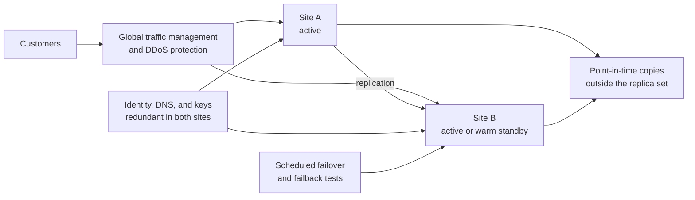

<!-- Generated by scripts/build.mjs from data/patterns/P22.json. Edit the data, then run npm run build. -->

[العربية](../ar/P22-resilient-availability.md)

# P22 Resilient availability across sites

> Tier your services by how long the business can live without them, run the critical ones across independent sites or regions with tested failover, and remove the single points of failure in identity, DNS, and connectivity that would take every site down at once.

| Domain | Related patterns |
| --- | --- |
| Operations | [P12 Ransomware-resilient recovery](P12-resilient-recovery.md), [P05 Protected internet edge and controlled egress](P05-internet-edge-and-egress.md), [P04 Segmentation and micro-segmentation](P04-segmentation.md) |

## The problem

A second data centre or cloud region is often in the plan but not in practice: failover has never been run from end to end, the standby depends on the same identity provider, DNS, or network link as the primary, and replication copies corruption and ransomware as faithfully as good data. Regulators now expect critical services to stay within tolerances for disruption, and to show evidence that they can.

## Use it when

- The business stops, or customers are harmed, within minutes or hours of an outage.
- A regulator sets tolerances for disruption, or expects tested continuity plans.
- The service runs in one site, one region, or on one provider.

## The design

Agree recovery time and recovery point objectives with the business for each service, and design to them: active-active across two sites or regions for the most critical, warm standby for the next tier, and restore from backup for the rest. Keep the sites independent, with their own power, network paths, and capacity, and make sure that identity, DNS, key management, and monitoring survive the loss of either site.

Protect replication from the failures it would spread: add delayed or point-in-time copies so that corruption and ransomware can be rolled back, and keep one copy outside the replicated set. Test failover and failback on a schedule, in production where possible, measure the real recovery times against the objectives, and keep capacity and DDoS protection sized for the whole load arriving at one site.

## Controls

### Foundation

- **Tier services by recovery objectives:** Agree recovery time and point objectives with the business for each service, and record them in the continuity plan.
  `NIST CP-2` `NIST RA-9` `CIS 11.1` `ISO A.5.30`
- **Remove shared single points of failure:** Make identity, DNS, key management, and network links redundant, so that no one of them can stop every site.
  `NIST CP-8` `NIST SC-36` `ISO A.8.14`
- **Protect against denial of service:** Use upstream DDoS protection sized for your peak, and rate limits in front of every public service.
  `NIST SC-5` `ISO A.8.20`

### Enhanced

- **Run critical services in two sites or regions:** Run the most critical services active-active, or with a warm standby, in an independent site or region.
  `NIST CP-7` `NIST CP-6` `ISO A.8.14`
- **Protect replication from corruption:** Keep delayed or point-in-time copies alongside replication, so that corruption and ransomware can be rolled back.
  `NIST CP-9` `NIST CP-10` `CIS 11.2` `ISO A.8.13`
- **Test failover and failback:** Fail over and fail back on a schedule, measure the real recovery times, and fix what missed the objectives.
  `NIST CP-4` `CIS 11.5` `ISO A.5.30`

### Advanced

- **Survive the loss of a provider:** For services that must not stop, remove the dependency on a single provider for hosting, DNS, or connectivity.
  `NIST SC-36` `NIST CP-8` `ISO A.5.30` `ISO A.8.14`
- **Rehearse severe but plausible scenarios:** Exercise scenarios such as the loss of a site together with a cyber attack, and report the results against your tolerances.
  `NIST CP-4` `NIST IR-3` `CIS 17.7` `ISO A.5.29`

## Decisions to record

- Which services need active-active, which need a warm standby, and which can wait for a restore?
- How far apart must the sites be, and do they share any provider, link, or dependency?
- How will you fail back after a failover, and who decides to do it?

## Trade-offs

- Active-active costs roughly twice as much and complicates data consistency, so keep it for the services that truly need it.
- Synchronous replication protects every transaction but limits distance and adds latency.
- Testing in production proves the design but carries the risk of the outage it rehearses.

## Anti-patterns to avoid

- A standby site that has never taken real traffic.
- Both sites depending on one identity provider or one DNS provider.
- Replication treated as a backup.

## How to verify it

- Fail a critical service over to the second site in business hours, and measure the time until customers are served again.
- Switch off the primary identity provider in a test, and confirm that sign-in still works.
- Restore a point-in-time copy from before a simulated corruption, and confirm that the data is clean.

## Threats it addresses

| Reference | Name |
| --- | --- |
| [T1498](https://attack.mitre.org/techniques/T1498/) | Network Denial of Service |
| [T1499](https://attack.mitre.org/techniques/T1499/) | Endpoint Denial of Service |
| [T1485](https://attack.mitre.org/techniques/T1485/) | Data Destruction |

## References

- [NIST SP 800-34 Rev 1, Contingency Planning Guide for Federal Information Systems](https://csrc.nist.gov/pubs/sp/800/34/r1/upd1/final)
- [NIST SP 800-160 Vol 2 Rev 1, Developing Cyber-Resilient Systems](https://csrc.nist.gov/pubs/sp/800/160/v2/r1/final)
- [ISO 22301, Business continuity management systems](https://www.iso.org/standard/75106.html)
