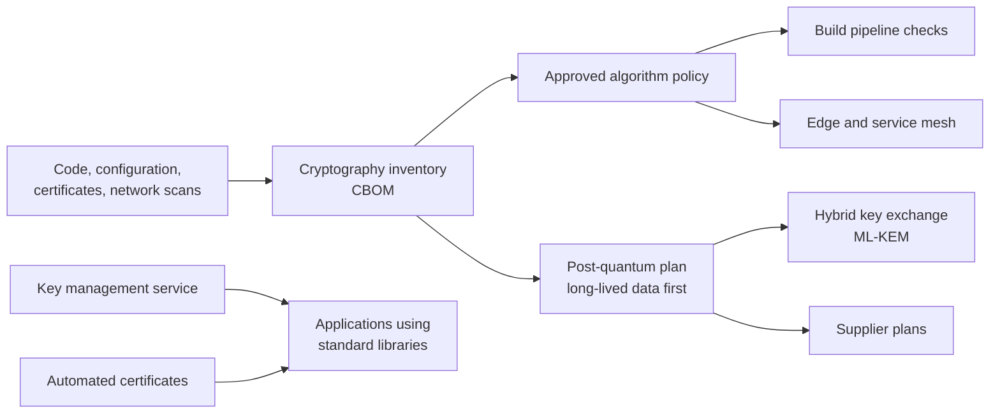

<!-- Generated by scripts/build.mjs from data/patterns/P23.json. Edit the data, then run npm run build. -->

[العربية](../ar/P23-crypto-agility.md)

# P23 Cryptographic agility and post-quantum readiness

> Know where and how you use cryptography, keep it behind a few well-managed services instead of inside every application, automate certificates and keys, and plan the move to the post-quantum algorithms that NIST has standardised, starting with data that must stay secret for years.

| Domain | Related patterns |
| --- | --- |
| Data | [P08 Secrets, keys, and workload identity](P08-secrets-keys-workload-identity.md), [P09 Data-centric protection](P09-data-centric-protection.md), [P15 Regulated enclave](P15-regulated-enclave.md) |

## The problem

Cryptography is spread through applications, devices, libraries, and supplier products, usually without an inventory, so weak algorithms and expiring certificates are found by outages rather than by plans. A future quantum computer will break the public key algorithms in use today, and attackers can record encrypted traffic now to decrypt it later, which already puts long-lived secrets at risk. Changing algorithms is slow when each application implements cryptography its own way.

## Use it when

- Data must stay confidential for many years, such as customer, health, or government records.
- Certificates, keys, and algorithms are managed by hand, application by application.
- A regulator or a customer asks for a plan for post-quantum cryptography.

## The design

Build a cryptographic inventory from code, configuration, certificates, and network scans, recorded as a cryptography bill of materials that lists algorithms, key sizes, protocols, and owners. Set a policy for approved algorithms and protocols, such as TLS 1.3 with TLS 1.2 as the minimum, and enforce it at the edge, in the service mesh, and in build pipelines, so that weak choices are caught before they ship.

Move cryptography behind shared services: a key management service, a certificate service with automated issuance and renewal, and standard libraries, so that changing an algorithm is a change of configuration, not a rewrite. Plan the migration to the NIST post-quantum standards, ML-KEM in FIPS 203 and ML-DSA in FIPS 204, starting with hybrid key exchange for traffic that protects long-lived data, and ask suppliers for their own plans.

## Controls

### Foundation

- **Inventory your cryptography:** Record where cryptography is used, with algorithms, key sizes, certificates, and owners, as a cryptography bill of materials.
  `NIST CM-8` `NIST SC-13` `ISO A.8.24`
- **Set an approved algorithm policy:** Approve algorithms and protocols, require TLS 1.2 at least and TLS 1.3 where possible, and retire weak ones on a schedule.
  `NIST SC-13` `NIST SC-8` `CIS 3.10` `ISO A.8.24`
- **Automate certificates:** Issue and renew certificates automatically, alert well before expiry, and keep private keys out of code and tickets.
  `NIST SC-17` `NIST SC-12` `ISO A.8.24`

### Enhanced

- **Put cryptography behind shared services:** Use a key management service and standard libraries, so that algorithms change through configuration.
  `NIST SC-12` `NIST SA-15` `ISO A.8.24` `ISO A.8.28`
- **Enforce the policy in pipelines and at the edge:** Fail builds that add weak algorithms, and reject weak protocols at load balancers and in the service mesh.
  `NIST SA-11` `NIST SC-8` `CIS 16.12` `ISO A.8.24` `ISO A.8.29`
- **Rank data by how long it must stay secret:** Identify data that must stay confidential beyond the next decade, and put its traffic first in the post-quantum plan.
  `NIST RA-3` `NIST SC-8` `CIS 3.7` `ISO A.5.12` `ISO A.8.24`

### Advanced

- **Adopt hybrid post-quantum key exchange:** Use hybrid key exchange that combines a classical algorithm with ML-KEM for traffic that protects long-lived data.
  `NIST SC-8` `NIST SC-13` `CIS 3.10` `ISO A.8.24`
- **Hold suppliers to a post-quantum plan:** Ask critical suppliers when they will support the NIST post-quantum standards, and make it a condition of new contracts.
  `NIST SR-3` `NIST SA-9` `ISO A.5.20`

## Decisions to record

- Which data must stay secret for more than ten years, and which systems carry it?
- Which algorithms and protocols are approved, and by what date must the weak ones be gone?
- Will you move to post-quantum algorithms through hybrid modes first, and where will you start?

## Trade-offs

- Post-quantum keys and signatures are larger, which affects bandwidth, storage, and some older devices.
- Hybrid modes add complexity for a period, in exchange for safety if either algorithm fails.
- Central cryptographic services make change easy but become critical dependencies that need high availability.

## Anti-patterns to avoid

- Certificates tracked in a spreadsheet and renewed by hand.
- Each application choosing and hard-coding its own algorithms.
- Waiting for quantum computers to arrive before building an inventory.

## How to verify it

- Scan your external endpoints, and confirm that none accepts protocols or ciphers outside the policy.
- List the certificates that expire in the next thirty days, and confirm that each one will renew automatically.
- Pick an application and change its key exchange algorithm through configuration alone, in a test environment.

## Threats it addresses

| Reference | Name |
| --- | --- |
| [T1040](https://attack.mitre.org/techniques/T1040/) | Network Sniffing |
| [T1557](https://attack.mitre.org/techniques/T1557/) | Adversary-in-the-Middle |
| [T1552.004](https://attack.mitre.org/techniques/T1552/004/) | Unsecured Credentials: Private Keys |

## References

- [NIST FIPS 203, Module-Lattice-Based Key-Encapsulation Mechanism Standard](https://csrc.nist.gov/pubs/fips/203/final)
- [NIST IR 8547, Transition to Post-Quantum Cryptography Standards](https://csrc.nist.gov/pubs/ir/8547/ipd)
- [Miftah, a cryptographic inventory tool with CBOM output](https://github.com/SiteQ8/miftah)
