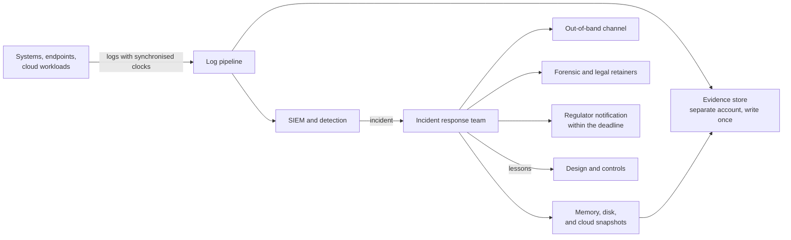

<!-- Generated by scripts/build.mjs from data/patterns/P24.json. Edit the data, then run npm run build. -->

[العربية](../ar/P24-forensic-readiness.md)

# P24 Forensic readiness and incident response

> Decide before an incident what evidence you will need, collect and protect it from the start with synchronised clocks and storage that resists tampering, prepare the tools and the out-of-band channels for responders, and rehearse, so that you can contain, investigate, and report within the hours a regulator allows.

| Domain | Related patterns |
| --- | --- |
| Operations | [P10 Security telemetry and detection pipeline](P10-detection-telemetry.md), [P12 Ransomware-resilient recovery](P12-resilient-recovery.md), [P03 Tiered privileged access](P03-tiered-privileged-access.md) |

## The problem

When an intrusion is found, the evidence that would explain it is often missing: logs were never enabled, were kept for days rather than months, or were deleted by the attacker with the same privileges that ran the systems. Responders lose the first hours arranging access, tools, and contracts, while the intruder may be reading email and chat, and reporting deadlines of a few hours pass without facts.

## Use it when

- A regulator requires incidents to be reported within hours or days.
- You may need to prove what happened to customers, courts, or insurers.
- An outside firm would lead the response, and nothing is agreed with it yet.

## The design

List the questions an investigation will ask, such as who signed in, what ran, and what left, and make sure the logs that answer them exist, carry synchronised timestamps, and are kept for at least a year. Store evidence where the people who run the systems cannot change it, in a separate account or tenant with write-once retention, and prepare a way to capture memory and disk images from endpoints and cloud workloads.

Prepare the response itself: a plan with roles and decision rights, retainers with forensic and legal firms, pre-approved access for responders, and an out-of-band channel for when email and chat cannot be trusted. Rehearse with tabletop and technical exercises, keep reporting templates ready for each regulator, and feed the lessons back into the design after every incident.

## Controls

### Foundation

- **Log what an investigation needs:** Enable the logs that show sign-ins, process execution, network flows, and data access, with synchronised clocks.
  `NIST AU-2` `NIST AU-8` `CIS 8.2` `CIS 8.4` `ISO A.8.15` `ISO A.8.17`
- **Keep evidence long enough:** Keep security logs for at least a year, and longer where regulation requires it.
  `NIST AU-11` `CIS 8.10` `ISO A.8.15`
- **Write and own an incident response plan:** Define roles, decision rights, severity levels, and reporting duties, with contact details that are kept current.
  `NIST IR-8` `NIST IR-6` `CIS 17.2` `CIS 17.4` `ISO A.5.24`

### Enhanced

- **Protect evidence from administrators:** Store logs and evidence in a separate account or tenant with write-once retention that system administrators cannot change.
  `NIST AU-9` `NIST AU-9(2)` `CIS 8.9` `ISO A.5.28` `ISO A.8.15`
- **Prepare collection before you need it:** Have the tools and permissions ready to capture memory, disks, and cloud snapshots, with a documented chain of custody.
  `NIST IR-4` `NIST AU-10` `CIS 17.4` `ISO A.5.28`
- **Agree outside help in advance:** Keep retainers with forensic and legal firms, and pre-approve their access so that they can start within hours.
  `NIST IR-7` `NIST IR-4` `CIS 17.2` `ISO A.5.24` `ISO A.5.26`

### Advanced

- **Keep an out-of-band channel:** Keep a communication channel and responder accounts that do not depend on the compromised environment.
  `NIST IR-4` `NIST CP-8` `CIS 17.6` `ISO A.5.26`
- **Rehearse and learn:** Run tabletop and technical exercises every year, and track the lessons from exercises and incidents until they are closed.
  `NIST IR-3` `NIST IR-4` `CIS 17.7` `CIS 17.8` `ISO A.5.27`

## Decisions to record

- Which regulators must be told of which incidents, and within how many hours?
- How long will each kind of log be kept, and where is it out of the administrators' reach?
- Who can decide to isolate a critical system during an incident, even if it stops the business?

## Trade-offs

- Long retention of detailed logs costs storage and raises privacy duties, so collect what investigations really use.
- Isolating systems quickly limits the damage but can destroy volatile evidence, so capture it first when it is safe to.
- Retainers cost money in the years without incidents.

## Anti-patterns to avoid

- Logs kept on the systems they describe, where an attacker can delete them.
- An incident plan that nobody has rehearsed.
- Coordinating the response over the email system that the attacker is reading.

## How to verify it

- Pick a past event and try to answer who, what, when, and from where from the logs alone, and note what is missing.
- As a system administrator, try to delete or change stored evidence, and confirm that you cannot.
- Run a tabletop exercise that reaches the step of notifying the regulator, and time each decision.

## Threats it addresses

| Reference | Name |
| --- | --- |
| [T1685.005](https://attack.mitre.org/techniques/T1685/005/) | Disable or Modify Tools: Clear Windows Event Logs |
| [T1070](https://attack.mitre.org/techniques/T1070/) | Indicator Removal |
| [T1685.002](https://attack.mitre.org/techniques/T1685/002/) | Disable or Modify Tools: Disable or Modify Cloud Log |

## References

- [NIST SP 800-61 Rev 3, Incident Response Recommendations and Considerations for Cybersecurity Risk Management](https://csrc.nist.gov/pubs/sp/800/61/r3/final)
- [NIST SP 800-86, Guide to Integrating Forensic Techniques into Incident Response](https://csrc.nist.gov/pubs/sp/800/86/final)
- [ISO/IEC 27037, Guidelines for identification, collection, acquisition, and preservation of digital evidence](https://www.iso.org/standard/44381.html)
