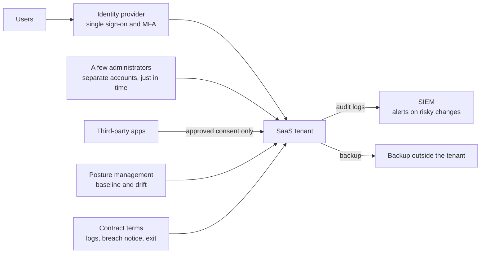

<!-- Generated by scripts/build.mjs from data/patterns/P25.json. Edit the data, then run npm run build. -->

[العربية](../ar/P25-saas-guardrails.md)

# P25 SaaS tenant guardrails

> Treat every SaaS tenant as a platform you run: harden its configuration against a baseline, keep administration small and strong, govern the third-party apps and integrations that can reach its data, and watch its logs, because the provider secures the service but you secure how it is set up.

| Domain | Related patterns |
| --- | --- |
| Platform | [P02 Identity as the control plane](P02-identity-control-plane.md), [P06 Cloud landing zone with guardrails](P06-cloud-landing-zone.md), [P20 Security service edge for users anywhere](P20-security-service-edge.md) |

## The problem

Most SaaS breaches are failures not of the provider but of the customer's settings: sharing open to anyone with the link, legacy protocols that skip MFA, too many global administrators, and third-party apps granted broad access through a single consent click. Each SaaS product has hundreds of settings that drift over time, audit logs that are often off or kept briefly, and data that the provider does not back up for your purposes.

## Use it when

- The business runs on SaaS such as email, collaboration, CRM, or HR platforms.
- Several teams administer their own SaaS tenants with no shared baseline.
- Staff can connect third-party apps to company data on their own.

## The design

Keep an inventory of every SaaS tenant with an owner, connect each one to the corporate identity provider with single sign-on and MFA, and disable local accounts and legacy protocols. Define a configuration baseline for each major tenant, such as the CISA SCuBA baselines, check the tenant against it continuously with a posture management tool, and treat drift as a finding with an owner.

Keep a handful of administrators with separate, phishing-resistant accounts and just-in-time elevation, and allow third-party apps only through an approval process that reviews the permissions they ask for. Send the tenant's audit logs to the SIEM with enough retention for investigations, alert on risky changes such as new forwarding rules or broad sharing, and back up the data you cannot afford to lose to a place the tenant's administrators cannot delete.

## Controls

### Foundation

- **Inventory tenants and give each an owner:** Record every SaaS tenant the organisation uses, with its owner, its data, and its administrators.
  `NIST CM-8` `NIST SA-9` `CIS 15.1` `ISO A.5.23`
- **Sign in only through the identity provider:** Enforce single sign-on and MFA for every user, and disable local accounts and legacy protocols that bypass them.
  `NIST IA-2` `NIST IA-2(1)` `CIS 6.3` `CIS 6.5` `ISO A.8.5`
- **Keep administrators few and separate:** Limit global administrators to a handful of separate accounts, and use narrower roles for everyday administration.
  `NIST AC-6` `NIST AC-6(5)` `CIS 5.4` `ISO A.8.2`

### Enhanced

- **Check tenants against a baseline continuously:** Define a secure configuration baseline for each major tenant, and use posture management to find and fix drift.
  `NIST CM-2` `NIST CM-6` `CIS 4.1` `ISO A.8.9`
- **Govern third-party apps and consent:** Block user consent to apps that ask for broad permissions, review integrations regularly, and remove unused ones.
  `NIST AC-3` `NIST CM-7` `CIS 2.1` `ISO A.5.19` `ISO A.5.23`
- **Log and alert on risky changes:** Send tenant audit logs to the SIEM, keep them long enough for investigations, and alert on forwarding rules, broad sharing, and new administrators.
  `NIST AU-2` `NIST AU-6` `CIS 8.2` `CIS 8.9` `ISO A.8.15` `ISO A.8.16`

### Advanced

- **Back up SaaS data outside the tenant:** Back up critical SaaS data to a store that the tenant's administrators cannot delete, and test restores.
  `NIST CP-9` `NIST CP-10` `CIS 11.2` `CIS 11.5` `ISO A.8.13`
- **Hold SaaS providers to security terms:** Require security terms in contracts, such as access to logs, breach notice, data location, and exit, and review them every year.
  `NIST SA-9` `NIST SR-3` `CIS 15.4` `ISO A.5.20` `ISO A.5.22`

## Decisions to record

- Which SaaS tenants hold sensitive data, and who owns each one?
- Which baseline applies to each tenant, and who approves exceptions?
- Which third-party apps may users approve themselves, and which need a review?

## Trade-offs

- Blocking user consent slows down teams that rely on integrations, so reviews must be quick.
- Longer log retention and backup by a third party add licence and storage costs.
- A strict baseline can disable features that some teams depend on.

## Anti-patterns to avoid

- Dozens of global administrators, some of them shared or synced from on premises.
- Sharing links open to anyone, with no expiry.
- Relying on the provider's recycle bin as the only backup.

## How to verify it

- Scan each major tenant against its baseline, and confirm that every deviation has an owner or an approved exception.
- List the third-party apps with access to mail or files, and confirm that each one was approved and is still used.
- Try to sign in with a legacy protocol, and confirm that it is refused.

## Threats it addresses

| Reference | Name |
| --- | --- |
| [T1528](https://attack.mitre.org/techniques/T1528/) | Steal Application Access Token |
| [T1550.001](https://attack.mitre.org/techniques/T1550/001/) | Use Alternate Authentication Material: Application Access Token |
| [T1078.004](https://attack.mitre.org/techniques/T1078/004/) | Valid Accounts: Cloud Accounts |
| [T1098](https://attack.mitre.org/techniques/T1098/) | Account Manipulation |

## References

- [CISA Secure Cloud Business Applications (SCuBA)](https://www.cisa.gov/resources-tools/services/secure-cloud-business-applications-scuba-project)
- [Cloud Security Alliance, Cloud Controls Matrix](https://cloudsecurityalliance.org/research/cloud-controls-matrix)
- [NIST SP 800-210, General Access Control Guidance for Cloud Systems](https://csrc.nist.gov/pubs/sp/800/210/final)
