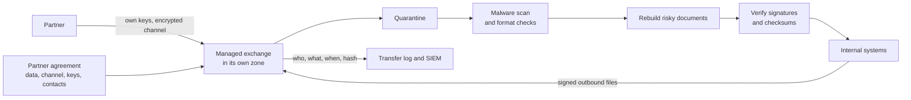

<!-- Generated by scripts/build.mjs from data/patterns/P26.json. Edit the data, then run npm run build. -->

[العربية](../ar/P26-partner-data-exchange.md)

# P26 Secure data exchange with partners

> Move files and data to and from partners through one managed exchange that authenticates each partner, encrypts and signs what moves, scans and sanitises what arrives, and keeps a record that neither side can dispute.

| Domain | Related patterns |
| --- | --- |
| Data | [P15 Regulated enclave](P15-regulated-enclave.md), [P09 Data-centric protection](P09-data-centric-protection.md), [P07 API gateway and object level authorization](P07-api-security.md) |

## The problem

Organisations exchange payment files, statements, and customer data with banks, suppliers, and regulators over a patchwork of SFTP servers, shared mailboxes, and scripts that nobody owns. Credentials are shared and never rotated, files arrive unscanned and go straight into core systems, and when a payment file is altered in transit or a partner is compromised, there is no record to show what was sent, by whom, and whether it changed.

## Use it when

- You send or receive files or bulk data with partners, suppliers, or regulators.
- Payment instructions, statements, or customer records travel as files.
- Exchanges run on servers and scripts that no single team owns.

## The design

Run every file exchange through one managed platform, in its own zone, that terminates partner connections, authenticates each partner with its own keys or certificates, and holds files in quarantine until they pass checks. Encrypt data in transit and at rest, sign files where the business depends on their integrity, such as payment instructions, and verify signatures and checksums before anything is released to internal systems.

Scan everything that arrives for malware, validate it against the expected format, and rebuild risky document types with content disarm and reconstruction, so that only clean, well-formed data moves inward. Bring each partner on board with an agreement that names the data, the channel, the keys, and the contacts, rotate keys on a schedule, and log every transfer with who, what, when, and a hash, so that disputes and investigations have evidence.

## Controls

### Foundation

- **Use one managed exchange:** Retire ad hoc SFTP servers, shared mailboxes, and scripts, and move every partner exchange onto one platform with an owner.
  `NIST CA-3` `NIST AC-4` `CIS 12.2` `ISO A.5.14`
- **Authenticate every partner separately:** Give each partner its own keys or certificates, never shared passwords, and rotate them on a schedule.
  `NIST IA-9` `NIST IA-5` `ISO A.5.17`
- **Encrypt data in transit and at rest:** Encrypt every transfer and every file held on the exchange, with keys managed outside it.
  `NIST SC-8` `NIST SC-28` `CIS 3.10` `CIS 3.11` `ISO A.8.24`

### Enhanced

- **Quarantine and scan what arrives:** Hold incoming files in quarantine, scan them for malware, and validate them against the expected format before release.
  `NIST SI-3` `NIST SI-10` `CIS 10.1` `ISO A.8.7`
- **Sign what the business depends on:** Sign payment instructions and other critical files, and verify signatures and checksums before they reach internal systems.
  `NIST SI-7` `NIST AU-10` `ISO A.8.24`
- **Log every transfer with a hash:** Record who sent what, when, and the hash of each file, and send the records to the SIEM.
  `NIST AU-2` `NIST AU-10` `CIS 3.14` `CIS 8.2` `ISO A.8.15`

### Advanced

- **Rebuild risky documents:** Use content disarm and reconstruction for office documents and PDF files from partners, so that active content never reaches users.
  `NIST SI-3` `NIST SC-44` `CIS 9.6` `ISO A.8.7`
- **Govern each exchange with an agreement:** Record the data, channel, keys, contacts, and incident duties for each partner in an agreement, and review it every year.
  `NIST CA-3` `NIST SA-9` `CIS 15.4` `ISO A.5.14` `ISO A.5.20`

## Decisions to record

- Which exchanges carry payments or customer data, and which of them need signing?
- Who owns the exchange platform, and who approves a new partner?
- Which file types will you accept from partners, and what happens to the rest?

## Trade-offs

- Moving partners onto one platform takes coordination with each of them, so it happens in waves.
- Rebuilding documents removes macros and active content that some partners rely on.
- Signing and key rotation add work for partners with small technical teams.

## Anti-patterns to avoid

- One SFTP account and password shared by every partner.
- Incoming files dropped straight into the folder that core systems read.
- Payment files exchanged by email.

## How to verify it

- Send a test file with a harmless malware signature, and confirm that it stays in quarantine.
- Change one byte of a signed test payment file, and confirm that it is rejected before release.
- Pick a transfer from last month, and confirm that the logs show who sent it, when, and its hash.

## Threats it addresses

| Reference | Name |
| --- | --- |
| [T1199](https://attack.mitre.org/techniques/T1199/) | Trusted Relationship |
| [T1565.002](https://attack.mitre.org/techniques/T1565/002/) | Data Manipulation: Transmitted Data Manipulation |
| [T1105](https://attack.mitre.org/techniques/T1105/) | Ingress Tool Transfer |
| [T1048](https://attack.mitre.org/techniques/T1048/) | Exfiltration Over Alternative Protocol |

## References

- [NIST SP 800-47 Rev 1, Managing the Security of Information Exchanges](https://csrc.nist.gov/pubs/sp/800/47/r1/final)
- [NCSC, Pattern: Safely importing data](https://www.ncsc.gov.uk/guidance/pattern-safely-importing-data)
- [RFC 4130, Secure business data interchange over HTTP (AS2)](https://datatracker.ietf.org/doc/html/rfc4130)
