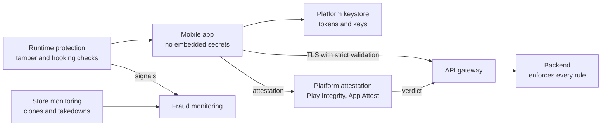

<!-- Generated by scripts/build.mjs from data/patterns/P27.json. Edit the data, then run npm run build. -->

[العربية](../ar/P27-mobile-app-protection.md)

# P27 Mobile application protection

> Assume the app runs on a device and in hands you do not control: keep secrets off the device, let the backend check that requests come from your genuine, untampered app, protect the data the app stores and sends, and build the app to the OWASP MASVS.

| Domain | Related patterns |
| --- | --- |
| Application | [P17 Customer identity and account protection](P17-customer-identity.md), [P07 API gateway and object level authorization](P07-api-security.md), [P11 Trusted software supply chain](P11-software-supply-chain.md) |

## The problem

A mobile app is software you hand to the attacker. It can be decompiled to find API keys and hidden endpoints, repackaged with malware and published under your name, run on rooted devices with hooking tools that bypass its checks, and targeted by overlay and accessibility malware that reads one-time codes. Backends that trust whatever the app sends, and apps that keep tokens or data in plain files, turn each of these into fraud.

## Use it when

- Customers use a mobile app to reach accounts, payments, or personal data.
- The app talks to APIs that are also reachable from the internet.
- Fraud through malware or cloned apps already reaches your customers or your sector.

## The design

Keep secrets and decisions on the server: the app holds no shared API keys, every request carries a short-lived token bound to the device, and the backend enforces authorization and limits as if the app did not exist. Use platform attestation, such as Play Integrity and App Attest, so that the backend can tell your genuine app on a genuine device from a script or a modified copy, and step up or refuse when it cannot.

Protect what the app keeps and sends: store tokens and keys in the platform keystore, keep sensitive data out of shared storage, logs, and screenshots, and use TLS with strict validation. Harden the app itself with obfuscation, tamper and hooking detection, and runtime protection for sensitive flows, test it against the OWASP MASVS before each major release, and watch the stores for clones that impersonate your brand.

## Controls

### Foundation

- **Keep secrets off the device:** Ship no shared API keys or credentials in the app, and issue short-lived tokens per user and per device instead.
  `NIST IA-5` `NIST SC-12` `ISO A.8.28`
- **Store data in the platform keystore:** Keep tokens and keys in the platform keystore, and keep sensitive data out of shared storage, logs, and backups.
  `NIST SC-28` `NIST SC-12` `CIS 3.11` `ISO A.8.24`
- **Enforce every rule on the server:** Let the backend enforce authorization, limits, and business rules, whatever the app claims.
  `NIST AC-3` `NIST SI-10` `CIS 16.10` `ISO A.8.26`

### Enhanced

- **Attest the app and the device:** Use platform attestation, so that the backend can tell the genuine app on a genuine device from scripts and modified copies.
  `NIST IA-3` `NIST SI-7` `ISO A.8.5`
- **Validate TLS strictly:** Use TLS with strict certificate validation, and pin certificates only with a tested plan for changing the pins.
  `NIST SC-8` `NIST SC-17` `CIS 3.10` `ISO A.8.24`
- **Test against the MASVS:** Test each major release against the OWASP MASVS, including a penetration test of the app and its APIs.
  `NIST SA-11` `NIST CA-8` `CIS 16.13` `ISO A.8.29`

### Advanced

- **Detect tampering and hooking at runtime:** Obfuscate the app, and detect tampering, hooking, and overlays during sensitive flows, reporting the signals to the backend.
  `NIST SI-7` `NIST SI-4` `ISO A.8.26`
- **Watch the stores for clones:** Monitor app stores and the web for apps that impersonate your brand, and keep a takedown process ready.
  `NIST SI-4` `NIST IR-4` `ISO A.5.7`

## Decisions to record

- Which actions in the app are sensitive enough to need attestation or step-up?
- What will the backend do when attestation fails: refuse, step up, or allow with limits?
- Will you pin certificates, and how will you change the pins without locking customers out?

## Trade-offs

- Attestation and root detection block some legitimate customers on older or modified devices.
- Runtime protection raises the cost of an attack but never makes the app trustworthy on its own.
- Pinning stops interception but can break the app when certificates change unexpectedly.

## Anti-patterns to avoid

- API keys or signing secrets embedded in the app.
- Business rules checked only in the app, and trusted by the backend.
- Tokens stored in plain files or in shared preferences.

## How to verify it

- Decompile the release build, and confirm that it contains no keys, secrets, or hidden endpoints.
- Call the APIs from a script with a valid user token, and confirm that the failed attestation triggers the agreed response.
- Run the app on a rooted test device with a hooking tool, and confirm that sensitive flows are protected and reported.

## Threats it addresses

| Reference | Name |
| --- | --- |
| [T1111](https://attack.mitre.org/techniques/T1111/) | Multi-Factor Authentication Interception |
| [M1:2024](https://github.com/OWASP/www-project-mobile-top-10/blob/master/2023-risks/m1-improper-credential-usage.md) | Improper Credential Usage |
| [M3:2024](https://github.com/OWASP/www-project-mobile-top-10/blob/master/2023-risks/m3-insecure-authentication-authorization.md) | Insecure Authentication/Authorization |
| [M5:2024](https://github.com/OWASP/www-project-mobile-top-10/blob/master/2023-risks/m5-insecure-communication.md) | Insecure Communication |
| [M7:2024](https://github.com/OWASP/www-project-mobile-top-10/blob/master/2023-risks/m7-insufficient-binary-protection.md) | Insufficient Binary Protection |
| [M9:2024](https://github.com/OWASP/www-project-mobile-top-10/blob/master/2023-risks/m9-insecure-data-storage.md) | Insecure Data Storage |

## References

- [OWASP Mobile Application Security Verification Standard (MASVS)](https://mas.owasp.org/MASVS/)
- [OWASP Mobile Top 10](https://owasp.org/www-project-mobile-top-10/)
- [NIST SP 800-163 Rev 1, Vetting the Security of Mobile Applications](https://csrc.nist.gov/pubs/sp/800/163/r1/final)
