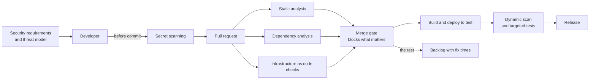

<!-- Generated by scripts/build.mjs from data/patterns/P28.json. Edit the data, then run npm run build. -->

[العربية](../ar/P28-secure-development.md)

# P28 Secure development lifecycle

> Build security into how software is made: agree requirements and threats at design time, check every change automatically for vulnerable code, dependencies, secrets, and misconfigured infrastructure, test running applications before release, and fix what is found within agreed times, following the NIST Secure Software Development Framework.

| Domain | Related patterns |
| --- | --- |
| Application | [P11 Trusted software supply chain](P11-software-supply-chain.md), [P07 API gateway and object level authorization](P07-api-security.md), [P21 Continuous exposure management](P21-exposure-management.md) |

## The problem

Security testing that happens once, just before go-live, finds problems when they are most expensive to fix, and teams learn to treat it as an obstacle. Meanwhile developers commit secrets, pull in vulnerable libraries, and write infrastructure code with open storage and broad permissions every day, and findings pile up in reports that nobody owns.

## Use it when

- Your teams write or customise software, including infrastructure as code.
- Releases are frequent, and manual security reviews cannot keep up.
- Penetration tests keep finding the same kinds of weakness.

## The design

Start at design: record security requirements for each application, threat model new features and major changes, and use approved components and patterns so that teams do not solve the same problems differently. Put checks where developers work: secret scanning before commit, static analysis, dependency analysis, and scanning of infrastructure as code on every pull request, with the results shown in the review instead of a separate portal.

Block merges only on findings that matter, such as leaked secrets, critical vulnerabilities, and exploitable dependencies, and send the rest to the backlog with fix times by severity. Test running applications with dynamic scans and targeted penetration tests before major releases, train developers on the weaknesses you actually find, and give each team a security champion who knows when to ask for help.

## Controls

### Foundation

- **Scan for secrets before they are committed:** Block commits that contain secrets, scan existing repositories, and rotate any secret that was ever exposed.
  `NIST IA-5` `NIST SA-11` `CIS 16.12` `ISO A.8.28`
- **Check dependencies on every build:** Analyse third-party components for known vulnerabilities and licences on every build, and keep them current.
  `NIST RA-5` `NIST SA-11` `CIS 16.4` `CIS 16.5` `ISO A.8.8` `ISO A.8.28`
- **Record security requirements for each application:** Agree the security requirements for each application at design time, based on its data and its exposure.
  `NIST SA-3` `NIST SA-8` `CIS 16.1` `ISO A.8.25` `ISO A.8.26`

### Enhanced

- **Analyse code and infrastructure on every pull request:** Run static analysis and checks of infrastructure as code on every pull request, and show the results in the review.
  `NIST SA-11` `NIST CM-3` `CIS 16.7` `CIS 16.12` `ISO A.8.28` `ISO A.8.29`
- **Threat model new features:** Threat model new features and major changes, and turn the results into requirements and tests.
  `NIST SA-8` `NIST RA-3` `CIS 16.14` `ISO A.8.27`
- **Fix findings within agreed times:** Rate application vulnerabilities by severity, set fix times for each level, and track them to closure.
  `NIST SI-2` `NIST RA-5` `CIS 16.2` `CIS 16.6` `ISO A.8.8`

### Advanced

- **Test running applications before release:** Run dynamic scans in the pipeline, and targeted penetration tests before major releases.
  `NIST SA-11` `NIST CA-8` `CIS 16.13` `ISO A.8.29`
- **Train developers and name security champions:** Train developers on the weaknesses you actually find, and give each team a security champion with time for the role.
  `NIST AT-3` `CIS 16.9` `ISO A.6.3`

## Decisions to record

- Which findings block a merge, and which go to the backlog?
- What fix times apply to each severity, and who can accept a risk instead?
- Which applications need a threat model and a penetration test before each major release?

## Trade-offs

- Blocking on every finding slows delivery and teaches teams to suppress results, so gates must be few and trusted.
- Scanners produce false positives that cost developer time until they are tuned.
- Security champions need time from their teams, which competes with work on features.

## Anti-patterns to avoid

- A single penetration test before go-live as the only security activity.
- Scan results sent to a portal that developers never open.
- Secrets removed from the code but never rotated.

## How to verify it

- Commit a test secret to a branch, and confirm that it is blocked before it reaches the repository.
- Add a dependency with a known critical vulnerability, and confirm that the pull request is blocked.
- Compare the findings of the last penetration test with the pipeline results, and add checks for what the pipeline missed.

## Threats it addresses

| Reference | Name |
| --- | --- |
| [T1552.001](https://attack.mitre.org/techniques/T1552/001/) | Unsecured Credentials: Credentials In Files |
| [T1195.002](https://attack.mitre.org/techniques/T1195/002/) | Supply Chain Compromise: Compromise Software Supply Chain |
| [T1213.003](https://attack.mitre.org/techniques/T1213/003/) | Data from Information Repositories: Code Repositories |
| [T1190](https://attack.mitre.org/techniques/T1190/) | Exploit Public-Facing Application |

## References

- [NIST SP 800-218, Secure Software Development Framework (SSDF)](https://csrc.nist.gov/pubs/sp/800/218/final)
- [OWASP Software Assurance Maturity Model (SAMM)](https://owaspsamm.org/)
- [CISA, Secure by Design](https://www.cisa.gov/securebydesign)
