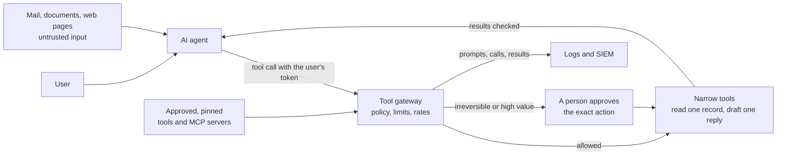

<!-- Generated by scripts/build.mjs from data/patterns/P29.json. Edit the data, then run npm run build. -->

[العربية](../ar/P29-ai-agents.md)

# P29 AI agents that use tools

> Let AI agents act only with the authority of the user they serve, through a gateway that checks every tool call against policy, limits what each call can do and how often, asks a person to approve actions that cannot be undone, and records everything, because an agent can be steered by any text it reads.

| Domain | Related patterns |
| --- | --- |
| AI | [P14 Guardrails for LLM applications and agents](P14-llm-application-guardrails.md), [P02 Identity as the control plane](P02-identity-control-plane.md), [P08 Secrets, keys, and workload identity](P08-secrets-keys-workload-identity.md) |

## The problem

Agents do not only answer questions: they read mail and documents, call APIs, run code, and change records. Any text they read, such as an email, a web page, or a document in a shared drive, can carry instructions that the model follows, and agents are often connected with broad service credentials that let one injected instruction move money, leak data, or delete records. Tools and servers added through protocols such as MCP bring their own code and permissions, often without review.

## Use it when

- An AI assistant can call tools, APIs, or other systems, not only answer questions.
- Agents read content from outside, such as email, web pages, or shared documents.
- Teams add tools or MCP servers to agents on their own.

## The design

Put a tool gateway between agents and everything they can touch. Each call carries the identity of the user the agent serves, with a scoped, short-lived token, never a broad service account, and the gateway checks the call against policy: which tools this agent may use, on which data, and with what limits on amount and rate. Keep tools narrow, such as reading one record or drafting one reply, rather than general ones such as running any query or sending any email.

Treat everything the agent reads as untrusted input, and never let it grant new authority: text in a document cannot approve a payment. Require a person to approve actions that are irreversible or of high value, showing exactly what will happen, validate tool outputs before they reach other systems, approve and pin every tool and MCP server like any other software dependency, and log each prompt, tool call, and result so that incidents can be traced.

## Controls

### Foundation

- **Act with the user's authority:** Give agents scoped, short-lived tokens on behalf of the user they serve, never broad service accounts.
  `NIST AC-6` `NIST IA-9` `CIS 6.8` `ISO A.5.15` `ISO A.8.2`
- **Keep tools narrow:** Expose small, specific tools with fixed parameters instead of general ones that can run any query or command.
  `NIST CM-7` `NIST AC-3` `ISO A.8.26`
- **Log every prompt, call, and result:** Record each prompt, tool call, and result with the identity of the user and the agent, and send them to the SIEM.
  `NIST AU-2` `NIST AU-12` `CIS 8.2` `ISO A.8.15`

### Enhanced

- **Check every tool call at a gateway:** Route tool calls through a gateway that enforces which tools, data, amounts, and rates each agent may use.
  `NIST AC-24` `NIST AC-4` `ISO A.5.15` `ISO A.8.26`
- **Ask a person before irreversible actions:** Require explicit approval, showing exactly what will happen, for payments, deletions, and messages sent outside.
  `NIST AC-3` `NIST IA-11` `ISO A.8.26`
- **Validate what tools return:** Treat tool outputs and retrieved content as untrusted, and validate them before they reach other systems or users.
  `NIST SI-10` `NIST SI-15` `ISO A.8.26`

### Advanced

- **Approve and pin tools and MCP servers:** Review each tool and MCP server before use, pin its version, and watch it for changes like any other dependency.
  `NIST SR-3` `NIST CM-7` `CIS 2.1` `CIS 16.4` `ISO A.5.21` `ISO A.8.19`
- **Red team the agent:** Test agents with indirect prompt injection through documents, mail, and web pages before release and after each change of tools.
  `NIST CA-8` `NIST SA-11` `CIS 16.13` `ISO A.8.29`

## Decisions to record

- Which actions may an agent take alone, and which need a person's approval?
- With whose authority does each agent act, and how is it limited?
- Who approves new tools and MCP servers, and how are they reviewed?

## Trade-offs

- Approvals slow the agent down, so they should cover only the actions that matter.
- Narrow tools need more engineering than one general tool, but they limit what an injected instruction can do.
- Full logs of prompts and results hold sensitive data, so the logs need the same protection as the data.

## Anti-patterns to avoid

- An agent connected with an administrator or a broad service account.
- A tool that runs any SQL query or any command the model writes.
- MCP servers installed from the internet without review or a pinned version.

## How to verify it

- Plant instructions in a document the agent will read, and confirm that it does not act on them.
- Ask the agent to act on data the user cannot access, and confirm that the gateway refuses.
- Trace one agent session from end to end in the logs, from the prompt to every tool call and result.

## Threats it addresses

| Reference | Name |
| --- | --- |
| [LLM01:2025](https://genai.owasp.org/llmrisk/llm01-prompt-injection/) | Prompt Injection |
| [LLM06:2025](https://genai.owasp.org/llmrisk/llm062025-excessive-agency/) | Excessive Agency |
| [LLM05:2025](https://genai.owasp.org/llmrisk/llm052025-improper-output-handling/) | Improper Output Handling |
| [LLM02:2025](https://genai.owasp.org/llmrisk/llm022025-sensitive-information-disclosure/) | Sensitive Information Disclosure |
| [LLM10:2025](https://genai.owasp.org/llmrisk/llm102025-unbounded-consumption/) | Unbounded Consumption |

## References

- [OWASP Top 10 for LLM Applications](https://genai.owasp.org/llm-top-10/)
- [OWASP, Agentic AI: Threats and Mitigations](https://genai.owasp.org/resource/agentic-ai-threats-and-mitigations/)
- [Model Context Protocol, Security Best Practices](https://modelcontextprotocol.io/specification/2025-06-18/basic/security_best_practices)
