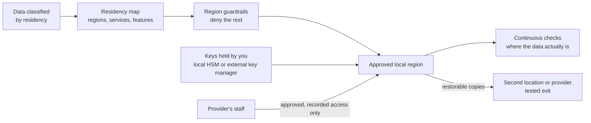

<!-- Generated by scripts/build.mjs from data/patterns/P30.json. Edit the data, then run npm run build. -->

[العربية](../ar/P30-sovereign-cloud.md)

# P30 Sovereign cloud and data residency

> Keep regulated data where the law requires, and under your control, when it runs in the cloud: choose regions and services by data class, hold the encryption keys yourself, control and record every access by the provider's staff, and keep an exit plan that works.

| Domain | Related patterns |
| --- | --- |
| Platform | [P06 Cloud landing zone with guardrails](P06-cloud-landing-zone.md), [P08 Secrets, keys, and workload identity](P08-secrets-keys-workload-identity.md), [P23 Cryptographic agility and post-quantum readiness](P23-crypto-agility.md) |

## The problem

Gulf regulators require regulated and government data to stay in the country: in Kuwait, for example, the CITRA cloud framework requires data at levels three and four of its classification to be hosted in the country by licensed providers. Cloud services copy data to other regions for backup, support, analytics, and AI features, the provider's staff can reach customer environments for support, and keys held by the provider leave the organisation unable to prove who can read its data. Contracts rarely say how to leave, so the dependence on one provider becomes permanent.

## Use it when

- Regulation or contracts say where certain data must be stored or processed.
- Government, financial, or personal data moves to the cloud.
- You must show a regulator who can access the data, including the provider.

## The design

Classify data by its residency requirement, and map each class to the regions, services, and features allowed to hold or process it, including backups, logs, support tickets, and AI features that may send data elsewhere. Enforce the map with policy guardrails that deny resources outside approved regions, and check where the data actually is continuously, not only at design time.

Hold the keys for regulated data yourself, in a local HSM or an external key manager, so that the provider cannot read the data without you, and use confidential computing where data must be protected while in use. Require approval and recording for any access by the provider's staff, keep copies you can restore in another location or with another provider, and test the exit plan before you need it.

## Controls

### Foundation

- **Classify data by residency:** Record for each data class where it may be stored and processed, including backups, logs, and support copies.
  `NIST SA-9(5)` `NIST RA-2` `CIS 3.2` `CIS 3.7` `ISO A.5.12` `ISO A.5.31`
- **Allow only approved regions:** Deny the creation of resources and replicas outside approved regions with policy across the whole organisation.
  `NIST SA-9(5)` `NIST CM-7` `ISO A.5.23`
- **Put residency into the contract:** Require data location, provider access, breach notice, and exit terms in the cloud contract.
  `NIST SA-9` `NIST SR-3` `CIS 15.4` `ISO A.5.20` `ISO A.5.23`

### Enhanced

- **Hold your own keys:** Keep the keys for regulated data in a local HSM or an external key manager that the provider cannot use without you.
  `NIST SC-12` `NIST SC-28` `CIS 3.11` `ISO A.8.24`
- **Control access by the provider:** Require your approval for any access by the provider's staff, and record each session.
  `NIST MA-4` `NIST AC-6` `ISO A.5.22`
- **Check where data actually is:** Scan resources, backups, and replicas continuously, and alert on any copy outside approved regions.
  `NIST CM-8` `NIST CA-7` `CIS 3.2` `ISO A.5.23`

### Advanced

- **Protect data in use:** Use confidential computing for the most sensitive processing, so that data stays encrypted in memory.
  `NIST SC-28` `NIST SC-13` `ISO A.8.24`
- **Test the exit:** Keep restorable copies in another location or with another provider, and rehearse moving a critical service.
  `NIST CP-9` `NIST CP-7` `CIS 11.4` `ISO A.5.30` `ISO A.8.13`

## Decisions to record

- Which data classes must stay in the country, and who decides?
- Which cloud features are off limits because they move or copy data elsewhere?
- Where will the keys live, and what happens if the key service is unavailable?

## Trade-offs

- Keeping keys outside the provider adds a critical dependency that must be highly available.
- Local regions often offer fewer services and features, and new ones arrive later.
- A real exit option costs money in the years you do not use it.

## Anti-patterns to avoid

- Residency checked for the main database but not for backups, logs, or support copies.
- Keys managed by the provider for data that must be provably under your control.
- An exit plan that exists only as a clause in the contract.

## How to verify it

- Try to create a storage account in an unapproved region, and confirm that policy refuses it.
- List where the backups and logs of a regulated service are actually stored, and compare them with the residency map.
- Disable the external key for a test dataset, and confirm that the provider can no longer read it.

## Threats it addresses

| Reference | Name |
| --- | --- |
| [T1199](https://attack.mitre.org/techniques/T1199/) | Trusted Relationship |
| [T1530](https://attack.mitre.org/techniques/T1530/) | Data from Cloud Storage |
| [T1537](https://attack.mitre.org/techniques/T1537/) | Transfer Data to Cloud Account |

## References

- [U.S. International Trade Administration, Kuwait cloud storage](https://www.trade.gov/market-intelligence/kuwait-cloud-storage)
- [NIST IR 8320, Hardware-Enabled Security for Cloud and Edge Computing](https://csrc.nist.gov/pubs/ir/8320/final)
- [Confidential Computing Consortium](https://confidentialcomputing.io/)
