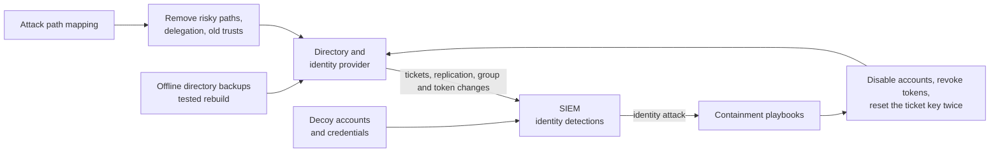

<!-- Generated by scripts/build.mjs from data/patterns/P31.json. Edit the data, then run npm run build. -->

[العربية](../ar/P31-identity-threat-detection.md)

# P31 Identity threat detection and response

> Watch the identity systems themselves for the attacks that turn stolen credentials into full control, such as Kerberoasting, DCSync, and forged tokens, reduce what those attacks can reach, and prepare to contain them in minutes by revoking sessions and resetting trust.

| Domain | Related patterns |
| --- | --- |
| Identity | [P02 Identity as the control plane](P02-identity-control-plane.md), [P03 Tiered privileged access](P03-tiered-privileged-access.md), [P10 Security telemetry and detection pipeline](P10-detection-telemetry.md) |

## The problem

Most intrusions end in the directory: attackers who get a foothold harvest service account tickets, replicate password hashes from domain controllers, add themselves to privileged groups, or forge tokens that the cloud identity provider accepts. Endpoint and network tools see little of this, because the activity uses valid protocols and valid accounts, and teams discover it only when the ransomware runs. Recovery then means rebuilding trust in every identity at once.

## Use it when

- Active Directory or a hybrid identity set-up runs the organisation.
- Service accounts, delegation, and trusts have grown over many years.
- Ransomware or a compromise of the directory is among your top risks.

## The design

Reduce what identity attacks can reach before you try to detect them: find and fix attack paths to privileged groups, give service accounts long random passwords or managed identities, remove unconstrained delegation and old trusts, and keep domain controllers and the identity provider in the top administrative tier. Assess the directory regularly with tools that map these paths, and track the findings like vulnerabilities.

Collect the signals that show identity attacks, such as ticket requests, directory replication, group changes, changes to federation and token signing, and risky sign-ins, and write detections for them in the SIEM. Plant decoy accounts and credentials that no one should ever use, and prepare playbooks that disable accounts, revoke sessions and tokens, reset the Kerberos ticket key twice, and rotate token signing certificates, rehearsed before they are needed.

## Controls

### Foundation

- **Find and fix attack paths:** Map the paths from ordinary accounts to privileged groups, and remove the permissions and memberships that create them.
  `NIST AC-6` `NIST AC-2` `CIS 5.1` `CIS 6.8` `ISO A.5.18` `ISO A.8.2`
- **Protect service accounts:** Give service accounts long random passwords or managed identities, and stop them from signing in interactively.
  `NIST IA-5` `NIST AC-2` `CIS 5.5` `ISO A.5.17`
- **Log what identity attacks leave behind:** Collect directory, ticket, replication, group change, and sign-in events, and send them to the SIEM.
  `NIST AU-2` `NIST AU-12` `CIS 8.2` `CIS 8.5` `ISO A.8.15`

### Enhanced

- **Detect identity attacks:** Write detections for Kerberoasting, directory replication from machines that are not domain controllers, changes to privileged groups, and forged tokens.
  `NIST SI-4` `NIST AC-2(12)` `CIS 8.11` `CIS 13.1` `ISO A.8.16`
- **Remove risky delegation and trusts:** Remove unconstrained delegation, old trusts, and legacy authentication, and review what remains every year.
  `NIST CM-7` `NIST AC-3` `CIS 4.8` `ISO A.8.9`
- **Prepare identity containment playbooks:** Rehearse disabling accounts, revoking sessions and tokens, resetting the Kerberos ticket key twice, and rotating token signing certificates.
  `NIST IR-4` `NIST AC-2` `CIS 17.4` `ISO A.5.26`

### Advanced

- **Plant decoy identities:** Create decoy accounts and credentials that no one should use, and alert on any attempt to use them.
  `NIST SI-4` `NIST AC-2(12)` `ISO A.8.16`
- **Keep a clean recovery path for identity:** Keep offline backups of the directory and a tested plan to rebuild it in an isolated environment.
  `NIST CP-9` `NIST CP-10` `CIS 11.4` `ISO A.8.13`

## Decisions to record

- Which accounts and systems sit in the top tier, and who can administer them?
- Who may disable accounts or reset trust during an incident, even when it stops the business?
- How will you rebuild the directory if you can no longer trust it?

## Trade-offs

- Removing old delegation and trusts breaks forgotten dependencies, so changes need testing and a way back.
- Identity detections are noisy at first, because legitimate tools behave like attacks.
- Resetting the Kerberos ticket key and signing certificates disrupts sign-ins, so the timing must be planned.

## Anti-patterns to avoid

- Service accounts with old passwords that never expire and rights as domain administrators.
- Directory events collected with no detections written for them.
- Recovery plans that restore the same compromised directory.

## How to verify it

- Run a tool that maps attack paths, and confirm that no ordinary account can reach a privileged group.
- Request a service ticket for a decoy account, and confirm that the alert fires within minutes.
- Run the containment playbook in a test domain, and time each step.

## Threats it addresses

| Reference | Name |
| --- | --- |
| [T1558.003](https://attack.mitre.org/techniques/T1558/003/) | Steal or Forge Kerberos Tickets: Kerberoasting |
| [T1003.006](https://attack.mitre.org/techniques/T1003/006/) | OS Credential Dumping: DCSync |
| [T1606.002](https://attack.mitre.org/techniques/T1606/002/) | Forge Web Credentials: SAML Tokens |
| [T1098](https://attack.mitre.org/techniques/T1098/) | Account Manipulation |

## References

- [MITRE ATT&CK, Credential Access](https://attack.mitre.org/tactics/TA0006/)
- [MITRE D3FEND](https://d3fend.mitre.org/)
- [CISA AA21-008A, Detecting Post-Compromise Threat Activity in Microsoft Cloud Environments](https://www.cisa.gov/news-events/cybersecurity-advisories/aa21-008a)
