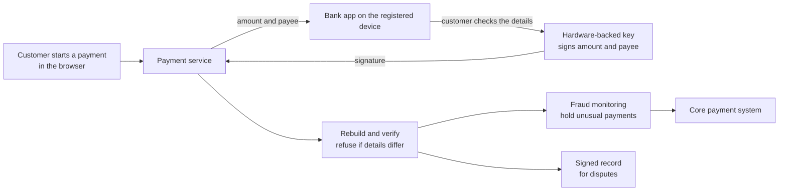

<!-- Generated by scripts/build.mjs from data/patterns/P32.json. Edit the data, then run npm run build. -->

[العربية](../ar/P32-transaction-signing.md)

# P32 Transaction signing for payments

> Confirm every sensitive transaction on its own details, the amount and the payee, with a factor that an attacker in the browser or the phone cannot change, and check the signed details on the server, so that a hijacked session cannot redirect money.

| Domain | Related patterns |
| --- | --- |
| Application | [P17 Customer identity and account protection](P17-customer-identity.md), [P27 Mobile application protection](P27-mobile-app-protection.md), [P15 Regulated enclave](P15-regulated-enclave.md) |

## The problem

Strong sign-in does not protect a payment made after sign-in. Malware in the browser or on the phone can change the payee and the amount after the customer enters them, show the customer the original details, and pass the one-time code through, and a phishing proxy can do the same with a live session. Codes that are not bound to the transaction approve whatever the attacker submits, and fraud teams see a payment that was authenticated correctly.

## Use it when

- Customers or staff move money, add payees, or approve payments online.
- A regulation requires strong customer authentication that is linked to the transaction.
- Fraud through malware or real-time phishing already reaches your customers.

## The design

Show the amount and the payee on a channel that the attacker cannot change, such as the bank's app on a registered device or a signing device, and have the customer approve those exact details with a key that signs them. The server rebuilds the transaction from what it received, checks the signature against those details, and refuses any payment whose details differ from what was signed.

Apply signing by risk: new payees, large amounts, changes to limits, and changes to contact details always need it, while small payments to trusted payees may not. Send signing results and device signals to fraud monitoring, hold unusual payments for review, and use standards such as FIDO-based payment confirmation where the customer's platform supports them.

## Controls

### Foundation

- **Bind approval to the transaction:** Make every approval code or signature depend on the amount and the payee, so that it cannot approve anything else.
  `NIST IA-11` `NIST AU-10` `ISO A.8.5`
- **Show the details on a separate channel:** Show the amount and the payee in the registered app or on a signing device, not only in the browser that started the payment.
  `NIST SC-37` `NIST IA-11` `ISO A.8.5`
- **Verify signed details on the server:** Rebuild the transaction on the server, check the signature against it, and refuse any payment whose details differ.
  `NIST SI-7` `NIST SI-10` `CIS 16.10` `ISO A.8.26`

### Enhanced

- **Sign by risk:** Require signing for new payees, large amounts, and changes to limits or contact details, and allow exemptions only by rule.
  `NIST IA-11` `NIST AC-3` `ISO A.5.15`
- **Send signing and device signals to fraud monitoring:** Combine signing results with device and behaviour signals, and hold unusual payments for review.
  `NIST SI-4` `NIST AU-6` `CIS 13.1` `ISO A.8.16`
- **Keep a record that cannot be disputed:** Store each signed approval with its details and device, protected from change, for disputes and regulators.
  `NIST AU-10` `NIST AU-9` `CIS 8.10` `ISO A.8.15`

### Advanced

- **Use hardware-backed keys for signing:** Keep signing keys in the device's secure hardware or in FIDO authenticators, bound to the registered device.
  `NIST SC-12` `NIST IA-5` `ISO A.8.24`
- **Protect the registration of signing devices:** Treat registering a new signing device as a high-risk change, with strong checks, a notice, and a delay before first use.
  `NIST IA-3` `NIST IA-5` `ISO A.5.17`

## Decisions to record

- Which transactions always need signing, and which exemptions will you allow?
- Which channel shows the details the customer approves, and what happens when the customer has no registered device?
- How long will signed approvals be kept, and who can read them in a dispute?

## Trade-offs

- Signing every payment adds friction, so exemptions for low risk must be defined carefully.
- Customers without a smartphone or a signing device need another secure channel, which costs more to run.
- Verification on the server needs the same transaction format on every channel, which touches core systems.

## Anti-patterns to avoid

- A one-time code sent with no amount or payee in the message.
- Transaction details shown and approved only in the browser that submitted them.
- Approvals checked by the app on the device and trusted by the server.

## How to verify it

- Change the payee of a test payment after approval, and confirm that the server refuses it.
- Replay the approval of one payment on another, and confirm that it fails.
- Register a new signing device on a test account, and confirm the notice and the delay before first use.

## Threats it addresses

| Reference | Name |
| --- | --- |
| [T1185](https://attack.mitre.org/techniques/T1185/) | Browser Session Hijacking |
| [T1557](https://attack.mitre.org/techniques/T1557/) | Adversary-in-the-Middle |
| [T1565.002](https://attack.mitre.org/techniques/T1565/002/) | Data Manipulation: Transmitted Data Manipulation |
| [T1111](https://attack.mitre.org/techniques/T1111/) | Multi-Factor Authentication Interception |

## References

- [OWASP Transaction Authorization Cheat Sheet](https://cheatsheetseries.owasp.org/cheatsheets/Transaction_Authorization_Cheat_Sheet.html)
- [W3C Secure Payment Confirmation](https://www.w3.org/TR/secure-payment-confirmation/)
- [Commission Delegated Regulation (EU) 2018/389 on strong customer authentication](https://eur-lex.europa.eu/eli/reg_del/2018/389/oj)
